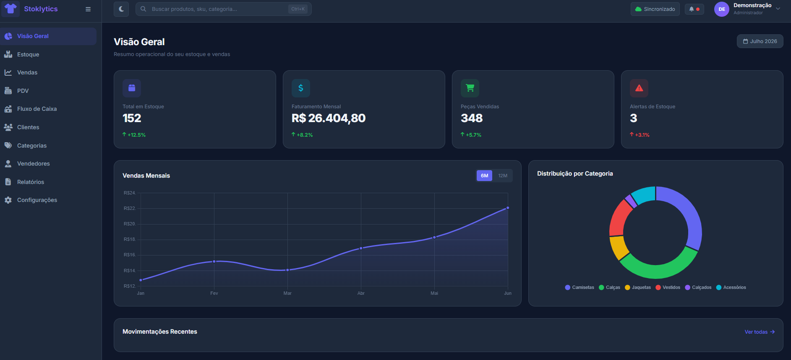

# Stoklytics

Um ERP web para lojas de moda, criado para reunir em um só lugar o controle de estoque, as vendas e a rotina da loja.

  

  <a href="https://venicio1.github.io/stoklytics-erp/">Acessar demonstração</a>

## Funcionalidades

- Painel com indicadores de vendas e estoque
- Cadastro de produtos, categorias e tamanhos
- PDV com cupons, descontos e diferentes formas de pagamento
- Gestão de clientes, vendedores e metas
- Controle de fluxo de caixa
- Relatórios e exportação de dados
- Temas claro e escuro

## Tecnologias

HTML, CSS e JavaScript no front-end, Node.js e Express na API e SQLite para armazenamento de dados.

## Demonstração

A versão publicada apresenta o painel com dados de exemplo. A API e o banco de dados precisam ser executados separadamente para salvar alterações.

  

